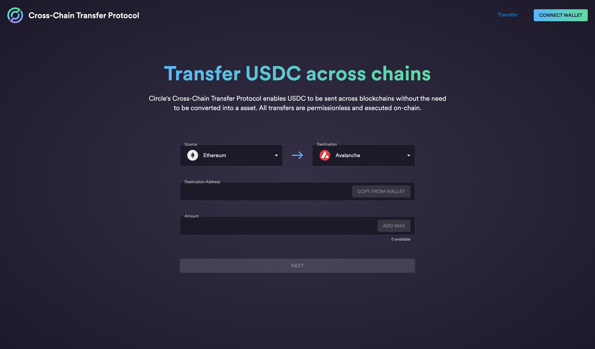

# CCTP Sample App

A sample app used to demonstrate CCTP step by step capabilities on testnet. The app currently supports Ethereum Goerli, Avalanche Fuji C-Chain, and Arbitrum Goerli testnets.



This project was bootstrapped with [Create React App](https://github.com/facebook/create-react-app).

# Setup

## Install dependencies

Install NVM

```
# Install nvm using brew
brew install nvm
# Or install it manually
curl -o- https://raw.githubusercontent.com/nvm-sh/nvm/v0.38.0/install.sh | bash
```

Use the correct node version (version found in .nvmrc)

```
nvm use
```

Install npm dependencies

```
yarn install
```

## Running the app

Run the sample app locally:

```
yarn start
```

The sample app will now be running on: http://localhost:3000.

## Testing

Launch the test runner in interactive watch mode

```
yarn test
```

Run tests with test converage.

```
yarn test:unit:coverage
```

### Linting/Formatting/Type Checks

We use eslint, prettier and typescript to validate our code. In combination with husky and lint-staged, we run a check on every precommit on staged changes.

You can also use `yarn check-all` or `yarn fix-all` to validate or fix all lint/format/typing issues. See [package.json](./package.json) for more details.

### Continuous Integration using Github Actions

We use Github actions to run linter and all the tests. The workflow configuration can be found in [github/workflows/ci.yml](./.github/workflows/ci.yml)

### Build and deploy

Build the app into static bundle

```
yarn build
```

To deploy, install and run `serve`

```
yarn global add serve serve -s build
```

See [deployment docs](https://facebook.github.io/create-react-app/docs/deployment) for more information.

# Instructions

## Adding a new chain

We have two config files which will be need to be updated to add a new chain support.

1. Add the chain enum and definitions

- In `./src/constants/chains.ts`, we need to add some enums and details for the chain to support. Add the new chain details to `Chain`, `SupportedChainId`, `SupportedChainIdHex`, `CHAIN_TO_CHAIN_ID`, `CHAIN_TO_CHAIN_NAME`, `DestinationDomain` and `CHAIN_ID_HEXES_TO_PARAMETERS`.

2. Add the addresses for the new chain

- In `./src/constants/addresses.ts`, we need to add the contract addresses for the new chain to support. For `CHAIN_IDS_TO_USDC_ADDRESSES`, `CHAIN_IDS_TO_TOKEN_MESSENGER_ADDRESSES` and `CHAIN_IDS_TO_MESSAGE_TRANSMITTER_ADDRESSES`, add the coressponding addresses for the new chain. This will allow the hooks to interact with the relevant addresses

3. Add the logo for the new chain

- We will also need to upload a svg image for the UI to display the chain logo. In `./src/assets/chains/`, add a svg logo for the new chain and then in `index.ts`, add the new icon to the `CHAIN_ICONS` map.

4. Add the new chain to the form dropdown selector

- In `./components/Send/SendForm.tsx`, Add the new chain to `CHAIN_SELECT_ITEMS` and this should automatically update the UI dropdown.

## Configuration for Mainnet

This sample app is development for testnet use, but if we want to update this for mainnet, these are the steps needed.

1. Update the chain definitions to mainnet

- In `./src/constants/chains.ts`, update the `SupportedChainId`, `SupportedChainIdHex` and `ChainParameter` objects with mainnet values. We may want to rename the enums as well.

2. Update the addresses to mainnet

- In `./src/constants/addresses.ts`, update the addresses with mainnet addresses. The mainnet address values can be found on https://developers.circle.com/stablecoin/docs.cctp-protocol-contract.

3. Update the attestation API URL

- In `./src/constants/index.ts`, update `IRIS_ATTESTATION_API_URL` with the mainnet value. The mainnet API url can be found on https://developers.circle.com/stablecoin/docs/cctp-getting-started#attestation-service-api.

## Setup Typechain

We use Typechain in this sample app to easily integrate smart contract with generated Typescript bindings. If we want to add some functionality and update the abis, we can update the abis as necessary in `./src/abis` and then run the following command to update the generated files.

```
typechain --target=ethers-v5 --out-dir src/typechain src/abis/*.json
```

This generates `typechain` folder under `src` containing contract types to be used by our hooks
